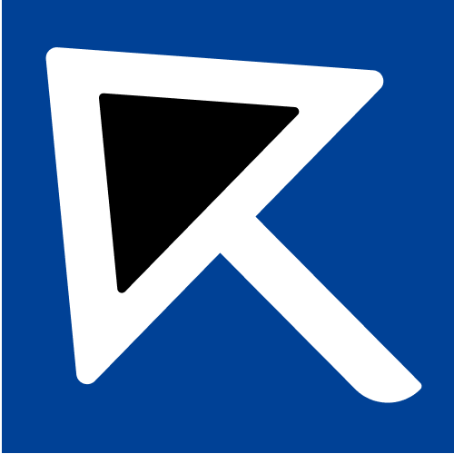
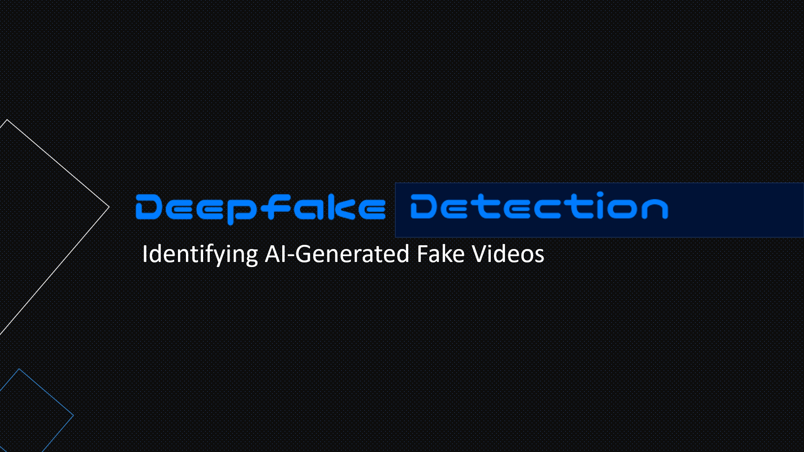

# RONIE CASACLANG

### About Me

I am a passionate **Full-Stack & Mobile Application Developer** dedicated to building clean, functional, and user-centric digital experiences. I enjoy turning complex problems into intuitive applications.

- Exploring new tech stacks and optimizing mobile app performance.
- Currently working on commission projects, specialized information systems, and developing mobile apps.
- Continuous learner holding industry certifications from DICT, Google, and Cisco.

---

### Tech Stack & Tools
Below are the languages, frameworks, and tools I frequently use in my development workflow:

<table border="1px solid white">
    <tr>
        <td>Language</td>
        <td>
            
        </td>
    </tr>
    <tr>
        <td>Mobile</td>
        <td>
            
        </td>
    </tr>
    <tr>
        <td>Frontend</td>
        <td>
            
        </td>
    </tr>
    <tr>
        <td>Framework</td>
        <td>
            
        </td>
    </tr>
    <tr>
        <td>Database</td>
        <td>
            
        </td>
    </tr>
    <tr>
        <td>Tools</td>
        <td>
            
        </td>
    </tr>
</table>

---

### Featured Projects

<table>
    <tr>
        <td>
            
        </td>
        <td>
            <a href="https://play.google.com/store/apps/details?id=com.juro.spookifyph"> Spookify: Scary Stories </a>
            A native Android application built using Java and Android Studio that provides users with an immersive, optimized reading platform for horror fiction.
        </td>
    </tr>
    <tr>
        <td>
            
        </td>
        <td>
            <a href="https://drive.google.com/drive/folders/1BmDgLMOlKsXv1sD_p5pAGCL4--qw5Xq2"> Deepfake Detection System </a>
            An advanced machine learning project focused on identifying manipulated facial media and synthetic video content to combat digital misinformation. The system utilizes automated frame extraction pipelines to prepare and analyze video datasets, ensuring high-accuracy detection patterns.
        </td>
    </tr>
    <tr>
        <td>
            
        </td>
        <td>
            <a href="https://linkhub-app.onrender.com"> LinkHub - Online Link Organizer </a>
            A responsive web application designed for centralizing and structuring web links into clean, organized dashboards for efficient bookmark management.
        </td>
    </tr>
</table>

---

### Get in Touch
I am always open to discussing new projects and opportunities. To keep project details organized and well-documented, I prefer asynchronous communication like email or chat rather than hopping on calls.

- Portfolio https://ronie-casaclang.github.io
- Email casaclangronie05@gmail.com
- Linkedin https://linkedin.com/in/ronie-casaclang
- Facebook https://facebook.com/ronie.casaclang
